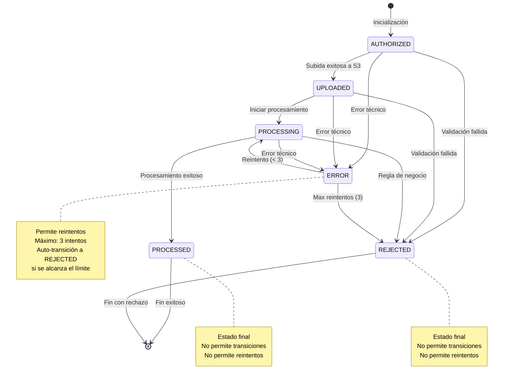

# Diagrama de Estados - File State Machine

## Flujo Principal (Happy Path)

```
AUTHORIZED → UPLOADED → PROCESSING → PROCESSED ✓
```

## Todos los Estados y Transiciones



## Tabla de Transiciones Permitidas

| Estado Actual | Estados Siguientes Permitidos | Permite Reintentos | Es Estado Final |
|---------------|-------------------------------|-------------------|-----------------|
| AUTHORIZED    | UPLOADED, REJECTED, ERROR     | ✗                 | ✗               |
| UPLOADED      | PROCESSING, REJECTED, ERROR   | ✗                 | ✗               |
| PROCESSING    | PROCESSED, REJECTED, ERROR    | ✗                 | ✗               |
| PROCESSED     | -                             | ✗                 | ✓               |
| REJECTED      | -                             | ✗                 | ✓               |
| ERROR         | PROCESSING, REJECTED          | ✓                 | ✗               |

## Escenarios de Uso

### Escenario 1: Procesamiento Exitoso
```
┌──────────────┐
│  AUTHORIZED  │  Validación de permisos y metadata
└──────┬───────┘
       │
       v
┌──────────────┐
│   UPLOADED   │  Archivo en S3 con integridad validada
└──────┬───────┘
       │
       v
┌──────────────┐
│  PROCESSING  │  Lectura y procesamiento de datos
└──────┬───────┘
       │
       v
┌──────────────┐
│  PROCESSED   │  ✓ Completado exitosamente
└──────────────┘
```

### Escenario 2: Error Recuperable con Reintento
```
┌──────────────┐
│  AUTHORIZED  │
└──────┬───────┘
       │
       v
┌──────────────┐
│   UPLOADED   │
└──────┬───────┘
       │
       v
┌──────────────┐
│  PROCESSING  │  ← Intento 1: Timeout
└──────┬───────┘
       │
       v
┌──────────────┐
│    ERROR     │  retryCount = 1
└──────┬───────┘
       │ retry()
       v
┌──────────────┐
│  PROCESSING  │  ← Intento 2: Éxito
└──────┬───────┘
       │
       v
┌──────────────┐
│  PROCESSED   │  ✓ Completado con 1 reintento
└──────────────┘
```

### Escenario 3: Max Reintentos Alcanzado
```
┌──────────────┐
│  AUTHORIZED  │
└──────┬───────┘
       │
       v
┌──────────────┐
│   UPLOADED   │
└──────┬───────┘
       │
       v
┌──────────────┐
│  PROCESSING  │  ← Intento 1: Error
└──────┬───────┘
       │
       v
┌──────────────┐
│    ERROR     │  retryCount = 1
└──────┬───────┘
       │ retry()
       v
┌──────────────┐
│  PROCESSING  │  ← Intento 2: Error
└──────┬───────┘
       │
       v
┌──────────────┐
│    ERROR     │  retryCount = 2
└──────┬───────┘
       │ retry()
       v
┌──────────────┐
│  PROCESSING  │  ← Intento 3: Error
└──────┬───────┘
       │
       v
┌──────────────┐
│    ERROR     │  retryCount = 3
└──────┬───────┘
       │ AUTO
       v
┌──────────────┐
│   REJECTED   │  ✗ Max retries exceeded
└──────────────┘
```

### Escenario 4: Error No Recuperable
```
┌──────────────┐
│  AUTHORIZED  │
└──────┬───────┘
       │
       v
┌──────────────┐
│   UPLOADED   │
└──────┬───────┘
       │
       v
┌──────────────┐
│  PROCESSING  │  Data corruption detected
└──────┬───────┘
       │ handleError(..., isRecoverable=false)
       v
┌──────────────┐
│   REJECTED   │  ✗ Non-recoverable error
└──────────────┘
```

### Escenario 5: Rechazo por Regla de Negocio
```
┌──────────────┐
│  AUTHORIZED  │
└──────┬───────┘
       │
       v
┌──────────────┐
│   UPLOADED   │
└──────┬───────┘
       │
       v
┌──────────────┐
│  PROCESSING  │  Duplicate detected
└──────┬───────┘
       │ rejectFile(reason)
       v
┌──────────────┐
│   REJECTED   │  ✗ Business rule violation
└──────────────┘
```

## Tipos de Errores

### Errores Recuperables (→ ERROR state)
- Network timeouts
- Temporary service unavailability
- Database connection issues
- Rate limiting
- Transient failures

**Acción**: Transición a ERROR, permitir reintento

### Errores No Recuperables (→ REJECTED state directo)
- Data corruption / integrity check failed
- Invalid file format (permanent)
- Duplicate file
- Invalid metadata (non-fixable)
- Authorization permanently denied

**Acción**: Transición directa a REJECTED, sin reintentos

## Contadores y Límites

- **MAX_RETRIES**: 3
- **Retry Count**: Se incrementa con cada retry()
- **Auto-Reject**: Cuando retryCount >= MAX_RETRIES

## Eventos Logged

Cada uno de estos eventos genera logs:

1. **Inicialización**: `File ${fileId} initialized in AUTHORIZED state`
2. **Transición**: `Transitioning from ${current} to ${next}. File: ${fileId}`
3. **Error Recuperable**: `Error in file ${fileId}: ${message}. Recoverable: true`
4. **Error No Recuperable**: `Non-recoverable error: ${message}`
5. **Reintento**: `Retrying file ${fileId}. Attempt: ${count}/${MAX_RETRIES}`
6. **Max Reintentos**: `Max retries reached for file: ${fileId}. Moving to REJECTED state.`
7. **Procesado**: `File successfully processed: ${fileId}`
8. **Rechazado**: `File rejected: ${fileId}. Reason: ${reason}`

## Metadata Tracked

Para cada archivo se rastrea:

```javascript
{
  fileId: string,
  currentState: string,
  retryCount: number,
  metadata: object,
  errorMessage: string | null,
  rejectionReason: string | null,
  stateHistory: [
    {
      timestamp: ISO8601,
      previousState: string,
      newState: string,
      retryCount: number,
      metadata: object
    }
  ],
  metrics: {
    authorized: number,
    uploaded: number,
    processing: number,
    processed: number,
    rejected: number,
    error: number
  }
}
```
